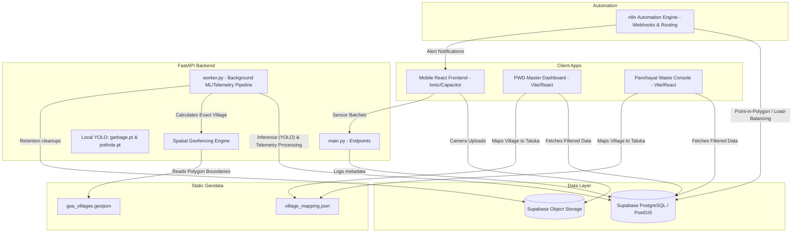

# GRIP (Goa Road Incident Portal) Architecture

This document provides a high-level overview of the GRIP platform's architecture, combining the mobile telemetry pipeline, the backend machine learning systems, and the granular spatial geofencing capabilities.

## System Architecture

## Core Components

### 1. Client Applications
- **Mobile App (`Ionic/Capacitor`)**: Used by the fleet and citizens to capture telemetry data and upload photos of hazards (garbage, potholes).
- **Web Dashboards (`Vite/React`)**: 
  - **PWD Command Center**: A master view showing aggregated road conditions and active reports across all Talukas (PWD divisions).
  - **Panchayat Console**: A specialized dashboard that strictly filters data using keyword extraction (e.g. "Priol") matched against the exact `village_name` to ensure local village admins only see incidents strictly within their jurisdiction.

### 2. FastAPI Backend & Automation
- **API (`main.py`)**: Handles incoming sensor batches and metadata logging directly from the mobile app.
- **AI Worker (`worker.py`)**: A heavy-duty background pipeline that runs inference on uploaded images using local YOLO models (`garbage.pt`, `pothole.pt`), aggregates telemetry into reliable road segments, flags SLA breaches, and manages storage cleanup.
- **Spatial Processor**: Integrated into the worker, it uses the `shapely` library and the `goa_villages.geojson` file to perform point-in-polygon checks. Every GPS coordinate uploaded is matched to its exact Goa revenue village before being saved to the database.
- **n8n Automation**: Manages complex routing, webhooks, point-in-polygon triggers, load-balancing, and alerting notifications back to the mobile clients.

### 3. Data & Storage Layer (Supabase)
- **Supabase PostGIS**: Stores the heavily normalized data:
  - `reports`: Citizen-submitted issues with exact `village_name` tags.
  - `road_segments`: Millions of telemetry points detailing road conditions.
  - `departments`: Directory of all government entities (PWD, Panchayats, Municipalities) used for dynamic routing, authentication, and dashboard data filtering.
- **Object Storage**: Handles all the raw camera uploads and media files submitted by users and the fleet.

## Geofencing Data Flow Example
1. The Mobile Frontend submits a pothole image and GPS coordinates.
2. The image goes to Storage; the sensor metadata goes to the API.
3. The AI Worker runs YOLO inference to confirm it's a pothole, calculates a confidence score, and runs a point-in-polygon check against `goa_villages.geojson` to determine the exact village.
4. The database `reports` table is updated with the new issue, marked with its precise `village_name`.
5. When a local Panchayat admin logs in, the React frontend dynamically filters the data pull against `village_mapping.json` so they only see the incidents directly inside their village boundary.
